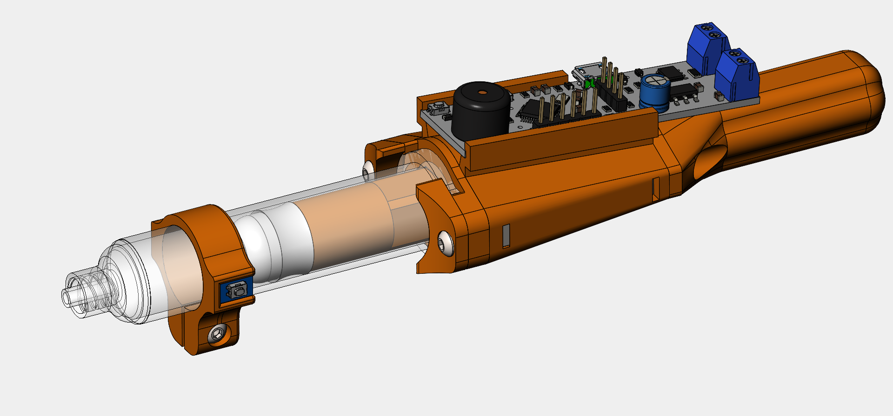

# 3D Printed Solder-Paste-Dispenser
Motorized automatic solder paste dispenser. Easily printable on a 3D printer at home
+ **Thanks [kevarek](https://hackaday.io/Kevarek) for inspiration from this [project:](https://hackaday.io/project/169748-low-cost-solder-paste-dispenser)**
+ The idea came from this project, including some parts of the source code that were partially or completely reworked and many new ones added. 

## __Work-in-progress__

### Some differences:

+ Controled with 32bit processor STM32F103C8T6 ( original is STM32F030)
+ used output H-bridge for motor control [TB67H451FNG](https://www.aliexpress.com/item/1005001738294266.html?spm=a2g0s.9042311.0.0.27424c4dVMVyey)
+ [DC micromotor 6V / 60 rpm](https://www.aliexpress.com/item/33022320164.html?spm=a2g0s.9042311.0.0.266b4c4dmW3uVV) with gearbox without thread rod 
+ [Coupler](https://www.aliexpress.com/item/1005002015620915.html?spm=a2g0s.9042311.0.0.266b4c4dmW3uVV) to thread rod 
+ larger [syringe 10 ccm](https://www.aliexpress.com/item/10000092421369.html?spm=a2g0s.9042311.0.0.27424c4dw27aah)
+ **redesigned mechanism of operation and piston mounting and mainly redesigned Syringe mount, which can be removed and put on without disassembling the dispenser**

!! warning component links may be invalid over time !!

+ [I2C OLED display 128x32](https://www.aliexpress.com/item/32879702750.html?spm=a2g0s.9042311.0.0.27424c4d1LUqwi) pixels for setting dispensing parameters and monitoring operating data
+ The supply voltage is 9V

+ **Resistor R2** (in schematic) for measuring motor current is in the current version mounted with the value 0R, because the possibility of measuring this current is not used at the moment. When this value (0R) is used, the H-bridge turns off motor current monitoring.

#### PCB is designed in KiCAD software

+ Source code of Firmware is optimized for STM32CubeIDE and CubeMX software from ST Microelectronics.

+ Source code are easy aplicable to another IDE.

+ It would be a little more difficult to migrate to the Arduino IDE, but even that is partially possible - it has not been tested

+ CAD files are designed in SolidWorks, preview [here](https://grabcad.com/library/3d-printed-solder-paste-dispenser-1):

+ All params are immeidiately saved to emulated EPROM(FLASH CPU) after select
+ Speed list : 10, 20, 30, 40, 50, 60, 70, 80, 99%
+ Retract duration List: 0(dissable), 100, 200, 300, 400, 500, 1000, 1500, 2000ms
+ Continuous measurement of battery voltage and CPU temperature
+ The firmware uses a non-blocking I2C DMA routine for the OLED Display (it saves about 20ms in Loop)
+ In addition, non-blocking User Timers derived from SysTick interrupts are used, which do not stop the CPU while waiting for the Timer to run out. The number of these Timers is limited only by the CPU speed and the amount of allocated RAM) *more about this in* [*main.c*](Software/CubeMX/Src/main.c)
+ **The continuation of the work consists in the completion of the control button mounted on the Syringe tube and the tuning of the SW for optimal paste dosing.** 
+ **This is a game with engine on and off times and duty cycle of PWM wave**
+ 
#### [Video from the first tests of movement mechanics](https://youtu.be/HmdS7s8p9XI) (redirect to YouTube) 
+ The first version of the printouts on my 3D printer

 

