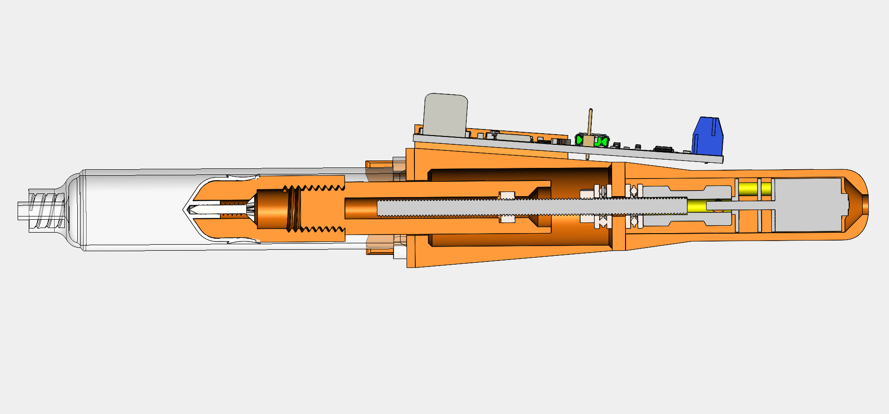

# 3D Printed Solder-Paste-Dispenser with DC motor
Motorized automatic solder paste dispenser. Easily printable on a 3D printer at home
+ **Thanks [kevarek](https://hackaday.io/Kevarek) for inspiration from this [project:](https://hackaday.io/project/169748-low-cost-solder-paste-dispenser)**
+ The idea came from this project, including some parts of the source code that were partially or completely reworked and many new ones added. 

## __Work-in-progress__ Latest version 2.21.11.3010

### Some differences:

+ Controled with 32bit processor STM32F103C8T6 ( original is STM32F030)
+ used output H-bridge for motor control [TB67H451FNG](https://www.aliexpress.com/item/1005001738294266.html?spm=a2g0s.9042311.0.0.27424c4dVMVyey). **No need cooling with during operation**.
+ 

+ [DC micromotor 6V / 60 rpm](https://www.aliexpress.com/item/33022320164.html?spm=a2g0s.9042311.0.0.266b4c4dmW3uVV) with gearbox without thread rod 

+ [Coupler](https://www.aliexpress.com/item/1005002015620915.html?spm=a2g0s.9042311.0.0.266b4c4dmW3uVV) 3/4mm to thread rod M4.
 

+ larger [syringe 10 ccm](https://www.aliexpress.com/item/10000092421369.html?spm=a2g0s.9042311.0.0.27424c4dw27aah)

+ **redesigned mechanism of operation and piston mounting and mainly redesigned Syringe mount, which can be removed and put on without disassembling the dispenser**

!! warning component links may be invalid over time !!

----------------------------------------------------------------------

+ [I2C OLED display 128x32](https://www.aliexpress.com/item/32879702750.html?spm=a2g0s.9042311.0.0.27424c4d1LUqwi) pixels for setting dispensing parameters and monitoring operating data
+ The supply voltage is 9V
+ The MicroUSB port is only used for 5V power supply when programming and debugging firmware to save battery. In this mode it is necessary to disconnect the 9V battery. The USB DM and DP pins are connected to the CPU, but the firmware does not respond to them. 
+ **Resistor R2** (in schematic) for measuring motor current is in the current version mounted with the value 0R, because the possibility of measuring this current is not used at the moment. When this value (0R) is used, the H-bridge turns off motor current monitoring.

#### PCB is designed by KiCAD software

+ Source code of Firmware is optimized for STM32CubeIDE and CubeMX software from ST Microelectronics.

+ Source code are easy aplicable to another IDE.

+ It would be a little more difficult to migrate to the Arduino IDE, but even that is partially possible - it has not been tested

+ CAD files are designed in SolidWorks, preview [here](https://grabcad.com/library/3d-printed-solder-paste-dispenser-1):

 

**Auto Extrusion cycle:**
+ PUSH button short switch ON -> Return from retract(retract duration time) -> Pulse for extrusion(pulse time) -> Retract(retract duration time)

**Manual Extrusion** 
+ PUSH button long switch ON(more as Retract duration time + Pulse time) -> extrusion until the PUSH button is switch OFF. This mode is used to insert a filled Syringe.

**Manual Retract**
+ PULL button switch ON -> retraction until the PULL button is switch OFF. This mode is using for remove and fill Syringe.
+
+ After selection, all parameters are immediately saved in the emulated EPROM (FLASH CPU).
+ Speed: 5, 10, 15 ...... 100% step by 5% 
+ Retract duration: 0(dissable), 100, 200 ...... 2500ms step by 100 milliseconds
+ Pulse after piston returned from retraction: 0(dissable), 100, 200 ..... 1500ms  step by 100 milliseconds 
+ Continuous measurement of battery voltage and CPU temperature
+ The firmware uses a non-blocking I2C DMA routine for the OLED display (this saves about 20 ms in the loop) **and Loop() no waiting to DMA complete as is usual in many of the examples given, which then makes the DMA a blocking wait routine**
+ In addition, non-blocking User Timers derived from SysTick interrupts are used, which do not stop the CPU while waiting for the Timer to run out. The number of these Timers is limited only by the CPU speed and the amount of allocated RAM) *more about this in* [*loop.c*](Software/CubeMX/Application/loop.c)

+ **Tasks**
+ [x] ***The continuation of the work consists in the completion of the control button mounted on the Syringe tube and the tuning of the SW for optimal paste dispensing. This is a game with engine on and off times and duty cycle of PWM wave***
+ [ ] Create a video with instructions for assembly and demonstration at work. Soon.
+ [ ] electronics attachment and power supply solution for the future possibility of 12V power supply from a 3D printer.
+ [ ] Next step is using this solder paste dispenser with a 3D printer. It may be necessary to use a stepping motor for dispensing instead. It has a better and more accurate dispensing control option. I have already finished the PCB for this variant with the DRV8825 controller and the NEMA14 stepper motor. 

UPDATE 11/22/2021:
- Syringe control button completed
- New version firmware 2.0. No blocked Dealy() in Loop() cycle

#### [Video from the first tests of movement mechanics](https://youtu.be/HmdS7s8p9XI) (redirect to YouTube) 
+ The first version of the printouts on my 3D printer

 

